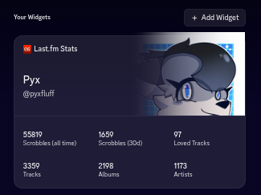

# Last.fm Discord Widget

Add a widget to your Discord profile with your Last.fm statistics!

*Warning: Discord made it so you can't put widgets on your profile you don't own. You need to make your own bot to use this now.*

## Requirements
- Python (3.13 or newer)
- `httpx`, `rich`, `orjson`

## Instructions
1. Set up the widget
    - This is out of scope for this README, but you can find good instructions here: https://chloecinders.com/blog/discord-widgets#how-to-make-discord-widgets
2. Ensure you have the correct label IDs
    - You will need the following keys:
       1. profile_picture_url (Last.fm profile picture)
       2. header_1 (your last.fm "real name")
       3. header_2 (your last.fm username)
       4. scrobbles_all_time
       5. loved_tracks
       6. scrobbles_recently (30 day window)
       7. tracks
       8. artists
       9. albums
3. Copy the configuration template
    - `cp config.json.templ config.json`
    - This is where you add your Discord app ID, user ID, etc. If you don't know that to put, read the guide. Feel free to put as many users as you want!
4. Run the script!
    - `python3 refresh.py`

After you add the widget to your profile, it should now reload every X minutes (set in the config file).

## Issues
Do NOT open issues for problems with Discord. You will be blocked from opening issues. Issues are exclusively for problems with the script. 

----

Made by [@pyxfluff](https://pyxfluff.dev)
